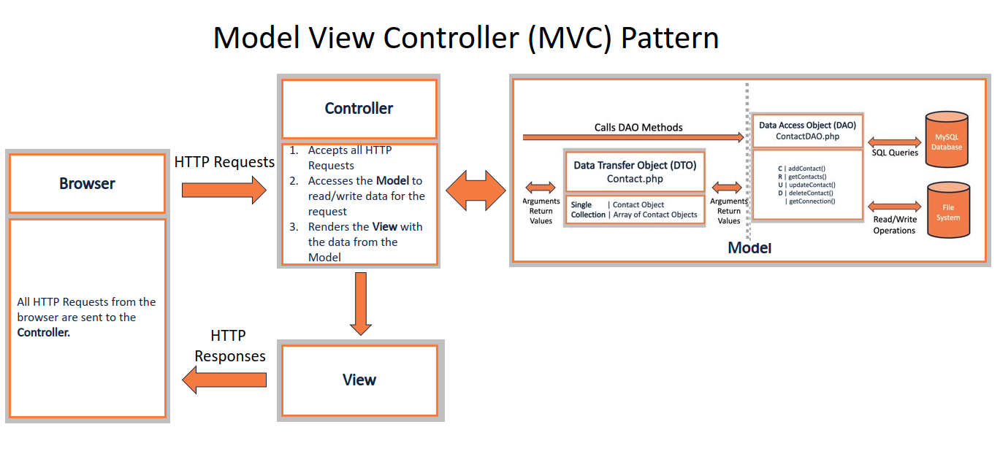

# Conversion of patternDAOv2 to Model View Controller (MVC)

This is the converted patternDAOv2 example from class converted to the MVC pattern.  This is not a reusable framework necessarily, but a straight conversion to illustrate the concepts and flow in MVC.

